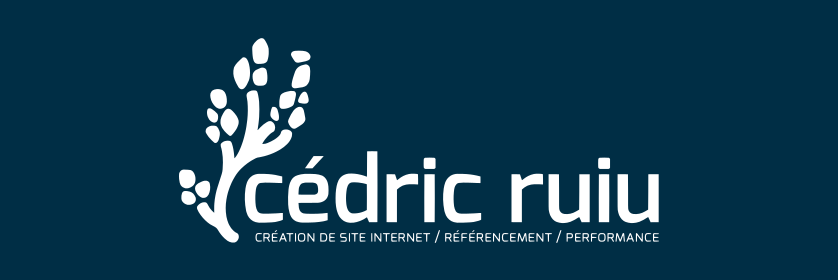

<p align="center">
  
</p>

<h1 align="center">cedric-ruiu.fr</h1>

<p align="center">
  The website of <strong>Cédric Ruiu</strong>, freelance web developer.<br>
  Static, dependency-free at runtime, and built to the performance budget it advertises.
</p>

<p align="center">
  <a href="https://github.com/Cedric-ruiu/cedric-ruiu.fr/actions/workflows/deploy.yml"></a>
  
  
  
  
  
</p>

---

## Overview

A six-page site — home, portfolio, contact, thank-you, legal notice, 404 — for a freelance web
developer working with tradespeople, sole traders and very small businesses, based in Brittany and
serving the whole of France.

The brief was self-imposed and set before the first line of code: a site that sells speed and
search visibility has no business being slow, breaking on a cheap phone, or dropping a cookie it
does not need. Everything below follows from that.

- **No runtime dependencies.** No framework, no CDN, no third-party script. The 1.1 kB mobile menu
  is the only JavaScript on the site, and every page works without it — the menu button is only
  revealed once the script runs, and the footer carries the same navigation.
- **No tracking.** No analytics, no pixel, no cookie — and therefore no consent banner. Zero
  requests leave for a third-party domain on any rendered page.
- **A budget, not an aspiration.** 300 kB per page on mobile, images included. The heaviest page
  currently uses 73 % of it; the home page, 37 %.
- **Mobile-first in the strict sense.** Unprefixed utilities are the mobile case; breakpoints only
  ever widen. Verified from 320 px up.
- **WCAG 2.1 AA.** Every colour pair in the palette is contrast-checked, form fields included.

## Measured results

Measured **2026-08-15** against the production build, served locally with gzip as in production,
under mobile emulation (Moto G Power, slow 4G, 4× CPU throttle). Lighthouse 13.4.1, median of three
runs.

| Page | Performance | Accessibility | Best practices | SEO | LCP | CLS |
|---|---|---|---|---|---|---|
| Home | 100 | 100 | 100 | 100 | 1.65 s | 0 |
| Portfolio | 100 | 100 | 100 | 100 | 1.80 s | 0 |
| Contact | 100 | 100 | 100 | 100 | 1.50 s | 0 |
| Legal notice | 100 | 100 | 100 | 100 | 1.50 s | 0 |
| 404 | 100 | 100 | 100 | 66 | 1.50 s | 0 |
| Thank-you | 100 | 100 | 100 | 66 | 1.50 s | 0 |

The 404 and thank-you pages are `noindex` by design, which Lighthouse scores down through its
`is-crawlable` audit. That is the intended outcome, not a defect.

| Page | Requests | Transferred | Budget used |
|---|---|---|---|
| Home | 11 | **100.7 kB** | 34 % |
| Portfolio | 16 | 215.8 kB | 72 % |
| Contact | 10 | 85.0 kB | 28 % |
| Legal notice | 10 | 85.5 kB | 28 % |
| 404 | 10 | 83.9 kB | 28 % |
| Thank-you | 10 | 84.0 kB | 28 % |

This table was re-measured in full on **2026-08-31**, when both lockups were replaced by a new,
lighter trace. Every page gained: the nav-and-footer lockup went from 9.7 kB of source to 5.3 kB and
is inlined two to three times per page, and the home page also carries the hero lockup, down from
29.8 kB to 12.2 kB. Home fell from 112.4 kB to 100.7 kB, the other five by about 2 kB each.
Lighthouse was re-run on the same build — every score and every CLS identical to the table above.

Both tables are deliberately pessimistic. The request count includes the manifest and the full icon
set, which Lighthouse fetches to test installability and a browser does not — a real client picks
one icon and caches it. The portfolio figure scrolls the whole page, so it counts all six
screenshots, where a visitor who lands and stays put loads three: about 154 kB in practice.

One stylesheet per page, **24,160 bytes** minified and **6,027 bytes** over the wire. One script,
**1,119 bytes** minified and **512 bytes** over the wire. On the home page the two self-hosted fonts
account for 57.6 kB and the icon set for a further 14.3 kB, leaving 29 kB for the document,
stylesheet, script and portrait combined.

## Stack

| Layer | Choice | Rationale |
|---|---|---|
| Static site generator | [Eleventy](https://www.11ty.dev/) 3 (ESM) | Six pages that change a few times a year need no database and no CMS to keep patched. Static HTML means nothing to execute server-side and free hosting. |
| Templating | Nunjucks + Markdown | Layouts hold the structure, prose stays in Markdown and is editable without tooling. |
| Styling | [Tailwind CSS](https://tailwindcss.com/) 4, CSS-first | No `tailwind.config.js`: the theme lives in `@theme`, in standard CSS. Only classes actually present in the templates are emitted. |
| Colour | Native **OKLCH** tokens | Perceptually uniform, so adjusting a hue does not silently break a contrast ratio — which matters when the whole palette must hold AA. |
| Content data | YAML in `_data/` | Copy and projects are data, not code. Raw values only; every derived form is an Eleventy filter, so there is one source of truth. |
| JavaScript | None, beyond one hand-written file | The mobile menu. Portfolio tiles are links and the contact form is a plain `POST`. |
| Fonts | Bitter + Manrope, self-hosted | Variable, latin subset, 57.6 kB for both. No Google Fonts request, so no user data leaves the site. |
| Contact form | [Web3Forms](https://web3forms.com/) | Static hosting cannot send mail. Web3Forms takes the POST and forwards it, without JavaScript and without a cookie. |
| Hosting | GitHub Pages + GitHub Actions | Free, HTTPS included, CDN-served. The repository is the source of truth: a merge deploys, and the Git history is the site's history. |
| Tooling | [Biome](https://biomejs.dev/) 2 | One tool for JS, CSS and JSON, in a fraction of the ESLint + Prettier runtime. |

## Getting started

Requires **Node 22** (see `.nvmrc`) and **Yarn 4** via Corepack. This project uses neither `npm` nor
`npx`.

```bash
git clone https://github.com/Cedric-ruiu/cedric-ruiu.fr.git
cd cedric-ruiu.fr
corepack enable
yarn install
yarn dev          # http://localhost:8080, live reload
```

| Command | Effect |
|---|---|
| `yarn dev` | Builds assets, then serves with live reload. |
| `yarn build` | Empties `_site/`, builds assets, writes the production site to `_site/`. |
| `yarn assets` | Fonts, minified script and generated images. Called by `dev` and `build`. |
| `yarn lint` | Biome check. |
| `yarn format` | Biome formatting and safe fixes. |

> Never run Eleventy with `--incremental`. The stylesheet would stop being regenerated when a
> template changes, and the dev server would serve a stale one.

## Structure

```
.
├── _data/                    # YAML content and constants — where the copy lives
│   ├── site.yml              #   identity, contact details, navigation, legal notice
│   ├── home.yml              #   every string on the home page
│   ├── projects.yml          #   portfolio entries
│   └── logos.js              #   logo variants, derived from the SVG sources
├── _includes/
│   ├── layouts/              # base layout plus one per page type
│   └── partials/             # header, footer, logo, icons
├── src/                      # Eleventy input: pages, images, stylesheet, sitemap
│   ├── index.md              #   home
│   ├── portfolio/            #   page + six screenshots
│   ├── contact/              #   form page + thank-you page
│   ├── mentions-legales/     #   legal notice
│   ├── 404.md
│   ├── sitemap.njk
│   └── assets/css/main.css   #   the entire Tailwind theme: palette, scale, components
├── assets/
│   ├── logos/                # three SVG sources, inlined into the HTML
│   ├── js/nav.js             # mobile menu source, minified at build
│   └── banner.png            # this file's header, rendered from logo.svg
├── public/                   # copied verbatim to the site root
│   ├── CNAME robots.txt favicon.* site.webmanifest
│   └── fonts/ js/ og.png     # generated at build, not versioned
├── scripts/                  # clean · copy-fonts · build-js · build-images
├── eleventy.config.js        # filters, shortcodes, CSS compilation, HTML minification
└── .github/workflows/deploy.yml
```

The logos are **inlined into the HTML rather than referenced as ``**. All three SVGs are
painted `fill="currentColor"` and carry no colour of their own, so a single file serves both light
and dark backgrounds, tinted by a utility class at the call site. An externally referenced SVG would
resolve `currentColor` against its own document and render black on the dark blue header.

## Editing content

Copy lives in `_data/`, so most changes touch no template at all.

| To change | Edit |
|---|---|
| Home page copy | `_data/home.yml` |
| Email, phone, town, navigation, form subject | `_data/site.yml` |
| Portfolio entries | `_data/projects.yml` |
| Body text of a page | The corresponding `.md` file under `src/` |
| A page's `title` or `description` | The front matter of that `.md` file |

Adding a project means dropping an 800 px-wide screenshot into `src/portfolio/` and appending a
block to `_data/projects.yml`. The source keeps whatever ratio it was captured at; the card is 16:10
and crops from the top, so the captured site's own header always survives. The build derives the
AVIF and WebP variants at 480 / 640 / 800 px, so no manual compression is needed, and the sources
themselves are never copied to the output. A project without a screenshot renders a neutral
fixed-ratio placeholder, so nothing shifts on the day the image arrives.

## Deployment

```
develop  ──(work, commits, review)──►  main  ──►  GitHub Actions  ──►  cedric-ruiu.fr
```

`develop` is the working branch and deploys nothing. Merging `develop` into `main` is the only
trigger: the workflow runs `yarn install --immutable`, then `yarn build`, then publishes `_site/`
to GitHub Pages. Roughly one to two minutes. `public/CNAME` must keep holding the custom domain, or
GitHub drops it on every deployment.

> **Status:** the site is complete and the workflow is in place; the DNS cutover to GitHub Pages is
> still pending, so `cedric-ruiu.fr` does not serve this build yet.

Three constraints of the platform are accepted rather than worked around. GitHub Pages sets **no
custom HTTP headers**, so there is no server-set CSP or HSTS — the site depends on neither, loading
no third-party script and storing nothing. It runs **no server-side code**, hence the form is
delegated to Web3Forms, which the legal notice discloses. And it serves **no pre-compressed files**,
so compression is the CDN's and minification at build time is the only remaining lever.

## Licence

Two regimes, set out in **[LICENSE.md](LICENSE.md)**:

- **the code** — templates, configuration, scripts, technical assets — is **MIT**, freely reusable;
- **the content** — copy, photographs, logo and visual identity — is the **exclusive property of
  Cédric Ruiu** and is not covered by the MIT licence.

Bitter and Manrope are distributed under the SIL Open Font License 1.1, whose texts ship alongside
the generated font files.
